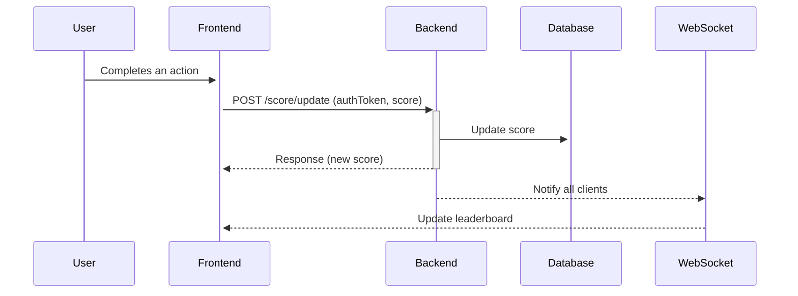

## Sequence Diagram

The following sequence diagram illustrates how the leaderboard update process works:

```mermaid
sequenceDiagram
    participant User
    participant Frontend
    participant Backend
    participant Database
    participant WebSocket

    User->>+Frontend: Completes an action
    Frontend->>+Backend: POST /score/update (authToken, score)
    Backend->>+Database: Update score
    Backend-->>-Frontend: Response (new score)
    Backend-->>WebSocket: Notify all clients
    WebSocket-->>Frontend: Update leaderboard
```
